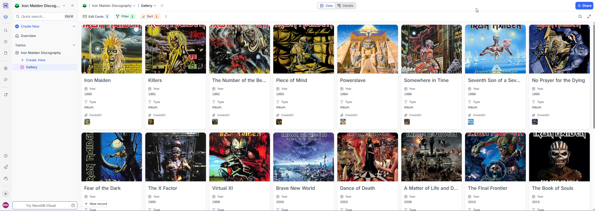
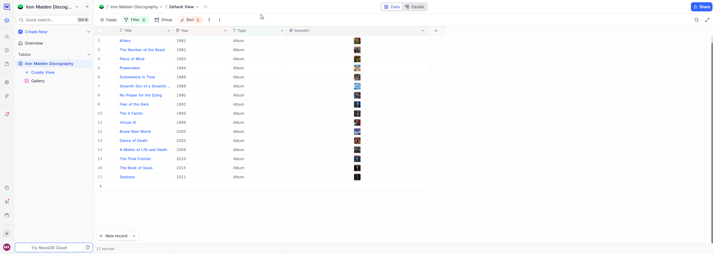

# 🤘 Iron Maiden Discography Database


A **Self-Hosted** database project designed to catalog and manage the complete discography of **Iron Maiden**.

The goal of this project is to demonstrate the implementation of modern data infrastructure using **Docker** and **No-Code** tools (NocoDB) for data curation and organization, moving away from traditional complex SQL setups.

## 🚧 Current Status & Roadmap

**Current Version: v1.0**
* ✅ **Studio Albums:** Fully cataloged with release year and cover arts.

**Roadmap (Upcoming Updates):**
1.  ⬜ **Singles:** Cataloging all official single releases.
2.  ⬜ **Live Albums:** Adding legendary recordings like *Live After Death*.
3.  ⬜ **Compilations:** Best Ofs and Box Sets.
4.  ⬜ **Obscure Releases:** Demos, B-Sides, and rare bootlegs.
5.  ⬜ **Member Lineup:** Tracking band members over the years.

## 📂 Open Data (Download)

Beyond the infrastructure, this project aims to provide a structured **Dataset** for the community. You can download the curated data directly from this repository:

* **[📂 Download CSV](dataset/iron_maiden_discography.csv)** (Best for Excel, Google Sheets, PowerBI)
* **[📂 Download JSON](dataset/iron_maiden_discography.json)** (Standard format for developers)

> *Note: The dataset files contain metadata and file references. Actual image files are hosted within the container instance.*

## 📸 Project Visualization

The system creates a user-friendly visual interface over the raw data.

### The "Showcase" (Gallery Mode)
Netflix-style visualization highlighting album covers:


### Data Structure (Grid Mode)
Tabular organization with fields for Title, Year, Attachments, and External Links:


## 🛠️ Infrastructure & Installation

The infrastructure is defined entirely via code (IaC) using Docker Compose.

**Requirements:** Docker installed.

### How to run the database:

1. Clone this repository or download the `docker-compose.yml` file.
2. Open your terminal and run:

```bash
docker-compose up -d
```

---

## ⚖️ License & Copyright / Licença e Direitos Autorais

**This is a strictly educational, non-profit project.** / **Este projeto é de cunho estritamente educacional e sem fins lucrativos.**

* **Code & Infrastructure / Código:** The project structure and Docker files are released under the **[MIT License](LICENSE)**.
* **Content / Conteúdo:** All images, album covers, logos, and names related to **Iron Maiden** are the intellectual property of **Iron Maiden Holdings Ltd.** and their respective record labels.
* **Fair Use / Uso Justo:** The use of low-resolution images for identification, criticism, commentary, and cataloging within an educational context qualifies as "Fair Use" under copyright law. This repository does not host any audio files (MP3/WAV).

---
*Study project focused on Containerization and Data Management.* UP THE IRONS! 🎸


